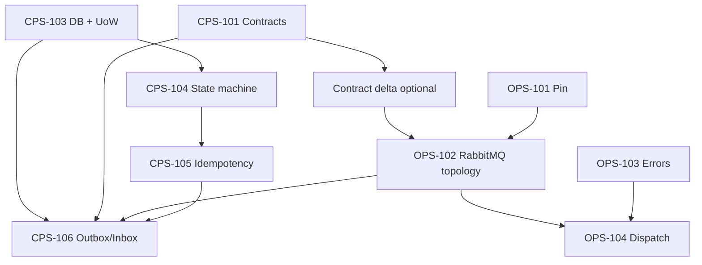

# Sprint 1B Persistence, Operations, and Messaging Implementation Plan

> **For agentic workers:** Sprint 1B is **closed** (2026-07-22). Tasks 1–12 and Definition of Done are complete; see §Sprint 1B closure evidence. Do not start Sprint 1C from this document.

**Goal:** Deliver PostgreSQL persistence with Alembic migrations and async unit-of-work, an operation state machine with immutable history and idempotent creation, a transactional outbox and inbox on CPS, and a complete RabbitMQ runtime with envelope validation and handler dispatch on OPS — without provider CRUD APIs, OpenStack calls, credential resolution, or CMP/LMS/Keycloak/TMS integration.

**Architecture:** CPS owns PostgreSQL, provider metadata, credentials, connections, operations, operation events, idempotency, transactional outbox, and inbox deduplication. OPS owns RabbitMQ topology, consumer/publisher runtime, envelope validation, and handler dispatch only. Cross-repo communication uses versioned message contracts pinned byte-for-byte from CPS. Connection metadata flows CPS → OPS in command payloads; OPS never reads OpenStack credentials from `.env`.

**Tech Stack:** CPython 3.12, PostgreSQL 18, SQLAlchemy 2.x async + Alembic, psycopg 3, RabbitMQ 4.1, aio-pika (robust connection, publisher confirms, manual ack), Pydantic 2.13.4, pytest, uv, ruff, mypy, detect-secrets, Husky/pre-commit.

**Canonical path (workspace root):** `cps/docs/superpowers/plans/2026-07-20-sprint-1b-persistence-operations-messaging.md`

**OPS working copy:** `ops/docs/superpowers/plans/2026-07-20-sprint-1b-persistence-operations-messaging.md` (byte-identical below this header block).

---

## Global Constraints

- CPython `>=3.12,<3.13`; PostgreSQL 18; RabbitMQ 4.1; Valkey 9.1.0 exists in Compose but **no Valkey runtime dependency** in CPS/OPS for Sprint 1B.
- CPS must not depend on OpenStackSDK; OPS must not add PostgreSQL or credential storage.
- CPS is the only editable source of message contracts; OPS pins byte-for-byte after CPS export.
- Unknown major `schema_version` is rejected; additive minor fields are accepted.
- No password, token, Authorization value, CA private material, or raw SDK/provider response bodies in fixtures, logs, errors, or persisted JSONB.
- `credential_reference` may appear in **command** payloads only; events and inventory payloads must not contain it.
- Do not modify Sprint 1A evidence files, applied Alembic revisions, or contract fixtures unless this plan's contract-delta task explicitly requires it.
- Do not read or print `.env` contents; `cps/.env.example` must exist; `cps/.env` is gitignored.
- No GitHub Actions; continue Husky/pre-commit gates.
- No legacy identifiers in paths or content.

## Dependency Graph



**Ordering rationale:** Persistence and operation invariants (CPS-103..105) land before messaging so outbox rows reference real aggregates. A transport delivery-metadata contract (without changing the envelope) precedes OPS-102 so topology tests validate retry headers from one source of truth. OPS-102 is whole before OPS-104. CPS-106 integrates last when both DB and OPS runtime exist.

## Increment Split

| Increment | Stories | Review focus |
|---|---|---|
| **1B-Must** | CPS-103, CPS-104, CPS-105 | Schema introspection, migration up/down, UoW rollback, state transitions, idempotency race |
| **1B-Messaging** | Contract delta, OPS-102, OPS-104, CPS-106 | Topology declaration, ack/retry/DLQ matrix, dispatch validation, outbox confirm + inbox dedupe |

---

## Database Design (CPS-103)

### Infrastructure conventions

| Topic | Decision |
|---|---|
| Engine | `create_async_engine(url, pool_pre_ping=True, pool_size=5, max_overflow=10)` |
| Session factory | `async_sessionmaker(engine, expire_on_commit=False, class_=AsyncSession)` |
| UoW | `SqlAlchemyUnitOfWork` context manager: `async with uow:` → `commit()` on success, `rollback()` on exception; exposes `session` and domain repositories |
| UUID | Application-generated **UUIDv7** for CPS-created entity IDs (`providers.id`, `operations.id`, etc.); columns remain PostgreSQL `UUID` with **no DB default** because the application must assign IDs before INSERT. **`claim_token`** stays UUIDv4. Incoming external UUIDs (`message_id`, `correlation_id`, envelope IDs) are preserved as received. Python 3.12 has no stdlib UUIDv7; **Task 3** introduces a single tested boundary `cps.identifiers.new_uuid7()` (dependency-backed, not hand-rolled RFC 9562). **Task 2** does not add the generator or a migration — schema type is unchanged. |
| Timestamps | `TIMESTAMP WITH TIME ZONE`; app sets UTC via `datetime.now(timezone.utc)`; DB default `now()` only where noted |
| Optimistic lock | `version INTEGER NOT NULL DEFAULT 1`; UPDATE … WHERE id = :id AND version = :v; increment on success |
| Naming | Tables plural snake_case; PK `pk_<table>`; FK `fk_<table>_<col>_<ref_table>`; unique `uq_<table>_<cols>`; index `ix_<table>_<cols>`; check `ck_<table>_<col>_<rule>` |
| Enums | PostgreSQL native ENUM types created in migration: `provider_status`, `connection_status`, `operation_state`, `outbox_publish_state`, `inbox_process_state` |
| JSONB | Safe domain payloads only; no EAV; no raw SDK objects |
| Soft delete | **Not** for providers/credentials/connections/operations; lifecycle via `status`/`state` columns |
| FK delete | `RESTRICT` everywhere in 1B, including `operation_events` → `operations`; audit history is not cascade-deleted |
| Alembic | First revision `20260720_0001_initial_persistence.py` from empty DB; downgrade drops enums last; never edit applied revisions |

### Table: `providers`

| Column | Type | Nullable | Default | Notes |
|---|---|---|---|---|
| id | UUID | NO | — | PK |
| name | VARCHAR(255) | NO | — | Display name |
| provider_type | VARCHAR(32) | NO | `'OPENSTACK'` | ck: only OPENSTACK in 1B |
| description | TEXT | YES | NULL | |
| status | provider_status | NO | `'ACTIVE'` | ACTIVE, DISABLED |
| version | INTEGER | NO | 1 | optimistic lock |
| created_at | TIMESTAMPTZ | NO | now() | |
| updated_at | TIMESTAMPTZ | NO | now() | |

**Indexes:** `ix_providers_status`, `ix_providers_name`.

### Table: `credentials`

| Column | Type | Nullable | Default | Notes |
|---|---|---|---|---|
| id | UUID | NO | — | PK |
| username | VARCHAR(255) | NO | — | never written to events/logs |
| password_ciphertext | BYTEA | NO | — | AES-256-GCM ciphertext; never plaintext-at-rest |
| password_nonce | BYTEA | NO | — | unique 96-bit nonce; CHECK octet_length = 12 |
| encryption_key_version | VARCHAR(64) | NO | — | required versioned key-provider lookup |
| user_domain_name | VARCHAR(255) | NO | `'Default'` | |
| version | INTEGER | NO | 1 | |
| created_at | TIMESTAMPTZ | NO | now() | |
| updated_at | TIMESTAMPTZ | NO | now() | |

**Crypto boundary:** `CredentialCipher` protocol exposes `encrypt_password` and `decrypt_password`; `AesGcmCredentialCipher` uses a 32-byte key supplied by an injected `CredentialKeyProvider`, authenticates `credential_id + key_version` as AAD, and stores nonce separately. Tests inject a deterministic test provider; production configuration must fail closed when no key exists. No plaintext credential is accepted by repositories, logs, fixtures, events, or outbox payloads.

**Unique:** `(encryption_key_version, password_nonce)` prevents nonce reuse under the same key. Negative migration tests reject non-12-byte and duplicate nonce/key pairs.

**Indexes:** none beyond PK (lookup by id only in 1B).

### Table: `provider_connections`

| Column | Type | Nullable | Default | Notes |
|---|---|---|---|---|
| id | UUID | NO | — | PK |
| provider_id | UUID | NO | — | FK → providers RESTRICT |
| credential_id | UUID | NO | — | FK → credentials RESTRICT |
| project_name | VARCHAR(255) | NO | — | OpenStack project |
| project_domain_name | VARCHAR(255) | NO | `'Default'` | maps organization boundary; part of connection identity |
| region_name | VARCHAR(255) | NO | — | OpenStack region |
| auth_url | VARCHAR(2048) | NO | — | Keystone URL |
| interface | VARCHAR(16) | NO | `'public'` | ck: public/internal/admin |
| verify_tls | BOOLEAN | NO | true | |
| ca_cert_pem | TEXT | YES | NULL | optional PEM |
| status | connection_status | NO | `'PENDING_VALIDATION'` | see enum below |
| capabilities | JSONB | YES | NULL | safe capability map |
| validation_error | JSONB | YES | NULL | CommonError shape, redacted |
| validated_at | TIMESTAMPTZ | YES | NULL | |
| version | INTEGER | NO | 1 | |
| created_at | TIMESTAMPTZ | NO | now() | |
| updated_at | TIMESTAMPTZ | NO | now() | |

**Unique:** `uq_provider_connections_provider_domain_project_region (provider_id, project_domain_name, project_name, region_name)` — one connection = one domain + project + region; identical project names in different domains do not collide.

**Indexes:** `ix_provider_connections_provider_id`, `ix_provider_connections_status`.

**connection_status enum:** `PENDING_VALIDATION`, `VALID`, `INVALID`, `DISABLED`.

### Table: `operations`

| Column | Type | Nullable | Default | Notes |
|---|---|---|---|---|
| id | UUID | NO | — | PK |
| provider_connection_id | UUID | NO | — | FK → provider_connections RESTRICT; provider is derived through the connection |
| operation_type | VARCHAR(128) | NO | — | e.g. `openstack.connection.validate` |
| state | operation_state | NO | `'ACCEPTED'` | see CPS-104 |
| progress_percent | SMALLINT | YES | NULL | CHECK 0–100 |
| idempotency_key | VARCHAR(128) | YES | NULL | client-supplied |
| request_fingerprint | CHAR(64) | NO | — | SHA-256 hex of canonical request JSON |
| request_payload | JSONB | NO | — | safe subset, no secrets |
| result_payload | JSONB | YES | NULL | safe result |
| error_payload | JSONB | YES | NULL | CommonError, redacted |
| correlation_id | UUID | NO | — | |
| causation_id | UUID | YES | NULL | |
| actor_context | JSONB | YES | NULL | `{ "actor_type", "actor_id" }` safe |
| provider_request_id | VARCHAR(128) | YES | NULL | from OpenStack when known |
| timeout_at | TIMESTAMPTZ | YES | NULL | |
| version | INTEGER | NO | 1 | CHECK > 0 |
| created_at | TIMESTAMPTZ | NO | now() | |
| updated_at | TIMESTAMPTZ | NO | now() | |

**Unique (idempotency):** partial unique index `uq_operations_idempotency (provider_connection_id, operation_type, idempotency_key) WHERE idempotency_key IS NOT NULL`.

**Indexes:** `ix_operations_provider_connection_id`, `ix_operations_state`, `ix_operations_created_at`, `ix_operations_correlation_id`.

### Table: `operation_events`

| Column | Type | Nullable | Default | Notes |
|---|---|---|---|---|
| id | UUID | NO | — | PK |
| operation_id | UUID | NO | — | FK → operations RESTRICT; operations/history are not deleted in 1B |
| sequence | INTEGER | NO | — | 1-based per operation; CHECK > 0 |
| event_type | VARCHAR(64) | NO | — | STATE_CHANGED, PROGRESS, ERROR, LATE_RESULT |
| from_state | operation_state | YES | NULL | |
| to_state | operation_state | YES | NULL | |
| message_id | UUID | YES | NULL | originating message |
| details | JSONB | NO | `'{}'` | redacted metadata |
| occurred_at | TIMESTAMPTZ | NO | now() | |

**Unique:** `uq_operation_events_operation_sequence (operation_id, sequence)`.

**Indexes:** `ix_operation_events_operation_id`.

### Table: `outbox_messages`

| Column | Type | Nullable | Default | Notes |
|---|---|---|---|---|
| id | UUID | NO | — | PK |
| aggregate_type | VARCHAR(64) | NO | — | e.g. `operation` |
| aggregate_id | UUID | NO | — | |
| message_id | UUID | NO | — | UNIQUE; equals envelope message_id |
| message_type | VARCHAR(128) | NO | — | |
| routing_key | VARCHAR(255) | NO | — | |
| payload | JSONB | NO | — | versioned envelope dict |
| publish_state | outbox_publish_state | NO | `'PENDING'` | PENDING, CLAIMED, PUBLISHED, FAILED |
| attempt_count | INTEGER | NO | 0 | CHECK >= 0 |
| next_attempt_at | TIMESTAMPTZ | NO | now() | scheduler claim |
| claimed_by | VARCHAR(128) | YES | NULL | publisher instance owning current lease |
| claim_token | UUID | YES | NULL | guards confirm/failure finalization |
| claim_expires_at | TIMESTAMPTZ | YES | NULL | expired CLAIMED rows are recoverable |
| last_error | TEXT | YES | NULL | truncated, no secrets |
| published_at | TIMESTAMPTZ | YES | NULL | set after broker confirm |
| version | INTEGER | NO | 1 | |
| created_at | TIMESTAMPTZ | NO | now() | |

**Checks:** CLAIMED requires all claim fields; non-CLAIMED requires claim fields NULL. `version > 0`.

**Indexes:** `ix_outbox_messages_publish_pending (publish_state, next_attempt_at) WHERE publish_state = 'PENDING'`; `ix_outbox_messages_claim_expiry (claim_expires_at) WHERE publish_state = 'CLAIMED'`.

### Table: `inbox_messages`

| Column | Type | Nullable | Default | Notes |
|---|---|---|---|---|
| id | UUID | NO | — | PK |
| consumer_name | VARCHAR(128) | NO | — | e.g. `cps.cloud.event.v1` |
| message_id | UUID | NO | — | envelope message_id |
| message_type | VARCHAR(128) | NO | — | |
| payload | JSONB | NO | — | envelope dict |
| process_state | inbox_process_state | NO | `'RECEIVED'` | RECEIVED, PROCESSED; only PROCESSED is ever committed |
| received_at | TIMESTAMPTZ | NO | now() | |
| processed_at | TIMESTAMPTZ | YES | NULL | |
| last_error | TEXT | YES | NULL | |

**Unique:** `uq_inbox_messages_consumer_message (consumer_name, message_id)`.

**Indexes:** `ix_inbox_messages_process_state`.

**Enum types:** `outbox_publish_state`: PENDING, CLAIMED, PUBLISHED, FAILED. `inbox_process_state`: RECEIVED, PROCESSED. RECEIVED exists only inside the processing transaction and is never a durable recovery state.

**Mutable timestamps:** every repository update sets `updated_at = now()` explicitly in the same statement; tests assert it advances. Migration tests introspect progress/version/sequence/attempt/claim CHECK constraints.

---

## Operation State Machine (CPS-104)

Aligned with approved design §9 — **not** the illustrative PENDING list from the backlog prompt.

### States

| State | Terminal | Description |
|---|---|---|
| ACCEPTED | no | Operation recorded, pre-queue |
| QUEUED | no | Outbox command scheduled/sent |
| RUNNING | no | OPS acknowledged work |
| WAITING_PROVIDER | no | Long-running provider wait |
| SUCCEEDED | yes | Success |
| FAILED | yes | Normalized failure |
| TIMED_OUT | yes | Deadline exceeded |

### Transition matrix

| From \ To | QUEUED | RUNNING | WAITING_PROVIDER | SUCCEEDED | FAILED | TIMED_OUT |
|---|---|---|---|---|---|---|
| ACCEPTED | ✓ | | | | | |
| QUEUED | | ✓ | | | ✓ | ✓ |
| RUNNING | | | ✓ | ✓ | ✓ | ✓ |
| WAITING_PROVIDER | | | | ✓ | ✓ | ✓ |
| SUCCEEDED | | | | | | |
| FAILED | | | | | | |
| TIMED_OUT | | | | | | |

**Rules:**
- Terminal states are immutable; further transitions raise `InvalidOperationTransition`.
- Every transition appends one `operation_events` row with monotonic `sequence`; `(operation_id, sequence)` unique.
- State update + event append + optional outbox insert occur in **one UoW transaction**.
- Optimistic conflict: stale `version` → `ConcurrentUpdateError` mapped to HTTP 409 in future API; in 1B service layer exception only.
- `actor_context`, `correlation_id`, `causation_id`, `provider_request_id` stored on operation; copied into event `details` when relevant.
- Error bodies use CommonError contract; strip credential fragments and raw HTTP bodies.

### Progress updates

- `RUNNING` / `WAITING_PROVIDER` may receive PROGRESS events without state change; `progress_percent` updated with version check.

---

## Idempotency (CPS-105)

| Topic | Decision |
|---|---|
| Scope | `(provider_connection_id, operation_type, idempotency_key)` when key present |
| Fingerprint | `sha256(canonical_json(request_payload))` — sorted keys, UTF-8, no whitespace variance |
| Same key + same fingerprint | Return existing operation (201 semantics deferred; service returns same id) |
| Same key + different fingerprint | `IdempotencyConflictError` (409) |
| Concurrent identical | DB unique index + catch `IntegrityError` → re-SELECT existing row |
| No key | Always create new operation |
| Retention/expiry | **Not in 1B** — no TTL job |

---

## Outbox / Inbox (CPS-106)

### Outbox publish flow

1. **TX open:** domain mutation + `INSERT outbox_messages` (PENDING).
2. **TX commit.**
3. Claim in one short TX: select eligible PENDING rows plus expired CLAIMED rows with `FOR UPDATE SKIP LOCKED`; atomically increment `attempt_count`, set `publish_state=CLAIMED`, `claimed_by`, a fresh `claim_token`, and `claim_expires_at`, then commit and return claimed payloads. Rows whose next claim would exceed max attempts become FAILED instead of being claimed.
4. Publish outside the DB transaction with **publisher confirms**; headers include validated delivery metadata.
5. On confirm: new short TX updates CLAIMED → PUBLISHED only when `(id, claim_token, claimed_by)` still matches, then clears lease fields and sets `published_at`.
6. On publish/confirm failure: guarded short TX returns to PENDING with backoff in `next_attempt_at`, or marks FAILED when the already-counted attempt reaches max; clear lease fields.
7. On publisher crash: another publisher reclaims only after `claim_expires_at`, and reclaim consumes the next attempt so repeated crashes eventually reach FAILED. Lease duration is 60s, publish-confirm timeout is 10s; no reclaim can occur during a conforming in-flight publish. Duplicate publication after broker acceptance remains possible and is handled by message-id dedupe.

**Never** hold DB transaction open during network confirm.

### Inbox consume flow

1. Receive message → parse envelope → validate schema major.
2. Open one TX and insert inbox RECEIVED using `INSERT ... ON CONFLICT DO NOTHING RETURNING id`.
3. If inserted, apply the domain handler and mark the same row PROCESSED in that TX; commit, then ack the broker delivery.
4. On handler/process crash, roll back inbox insert and domain mutation together; redelivery can insert again.
5. On conflict, wait for the competing transaction and read the existing row. Because RECEIVED and domain effects are one transaction, the only committed conflicting state is PROCESSED; ACK it as a duplicate. Rollback leaves no conflicting row.

### Crash matrix

| Scenario | Outbox behavior | Inbox behavior |
|---|---|---|
| Crash before TX commit | No outbox row; operation rollback | No inbox row; message redelivered |
| Crash after commit, before publish | Row PENDING; republish on restart | — |
| Publish fails | attempt_count++; retry | — |
| Broker received, confirm lost | Row PENDING; republish may duplicate → OPS idempotent by message_id | — |
| Confirm OK, DB update fails | **Risk: duplicate publish**; mitigation: consumer dedupe by message_id; outbox republication safe if confirm not recorded | — |
| Publisher dies after claim | Lease remains CLAIMED; another worker reclaims only after expiry | — |
| Two publishers claim concurrently | `FOR UPDATE SKIP LOCKED` + CLAIMED lease gives disjoint rows | — |
| Process dies after inbox insert, before domain commit | — | single TX rolls back insert and domain mutation; redelivery |
| Duplicate delivery after successful processing | — | existing PROCESSED row → skip handler, ack |
| Concurrent duplicate while first TX is open | — | unique insert waits; after winner commits, loser observes PROCESSED and ACKs; after winner rollback, loser inserts and processes |

---

## RabbitMQ Topology (OPS-102)

### Exchanges (all durable, not auto-delete)

| Name | Type | Purpose |
|---|---|---|
| `cmp.cloud.command.v1` | topic | CPS → OPS commands |
| `cmp.cloud.event.v1` | topic | OPS → CPS events |
| `cmp.cloud.retry.v1` | direct | delayed retry ingress |
| `cmp.cloud.dlx.v1` | topic | Dead letters |

### Queues

| Queue | Binds to | Routing keys | Args |
|---|---|---|---|
| `ops.command.v1` | command | `openstack.#`, `cloud.operation.command.#` | DLX → dlx, `x-dead-letter-routing-key=ops.command.dlq` |
| `ops.command.retry.1.v1` | retry | `ops.command.retry.1` | TTL 30s; DLX=`cmp.cloud.command.v1`, concrete DLRK=`openstack.retry` |
| `ops.command.retry.2.v1` | retry | `ops.command.retry.2` | TTL 120s; DLX=`cmp.cloud.command.v1`, concrete DLRK=`openstack.retry` |
| `ops.command.dlq.v1` | dlx | `ops.command.dlq` | durable |
| `cps.cloud.event.v1` | event | `cloud.operation.#`, `cloud.inventory.#` | DLX → dlx, DLRK=`cps.cloud.event.dlq` |
| `cps.cloud.event.retry.1.v1` | retry | `cps.cloud.event.retry.1` | TTL 30s; DLX=`cmp.cloud.event.v1`, concrete DLRK=`cloud.operation.retry` |
| `cps.cloud.event.retry.2.v1` | retry | `cps.cloud.event.retry.2` | TTL 120s; DLX=`cmp.cloud.event.v1`, concrete DLRK=`cloud.operation.retry` |
| `cps.cloud.event.dlq.v1` | dlx | `cps.cloud.event.dlq` | durable |

CPS publisher uses same exchange names when implemented in CPS-106.

### Runtime settings

- `aio_pika.connect_robust` with heartbeat 30s.
- `channel.set_qos(prefetch_count=10)`.
- Consumer: `no_ack=False` (manual ack).
- Publisher: `confirm_delivery=True`.
- On reconnect: redeclare topology idempotently via `TopologyBuilder.declare(channel)`.
- Graceful shutdown: stop consuming → drain in-flight handlers → publish pending confirms → close.

### Retry header contract

RabbitMQ headers (not JSON body):

| Header | Type | Description |
|---|---|---|
| `x-message-id` | string | UUID string, mirrors envelope |
| `x-attempt` | int | 1-based delivery attempt |
| `x-max-attempts` | int | default 3 |
| `x-retry-reason` | string | stable code |
| `x-correlation-id` | string | UUID |
| `x-original-routing-key` | string | allowlisted original command routing key; required on retry |

Retry routing: publish to retry exchange with concrete key `ops.command.retry.{n}`, preserve validated original key in `x-original-routing-key`, wait for confirm, then ACK the original. TTL expiry dead-letters once to concrete command key `openstack.retry`, which is bound by `ops.command.v1`; dispatch uses the validated envelope message type and original-key allowlist. Exhausted/poison messages use `reject(requeue=False)` once and rely solely on the main queue DLX. Never both republish and reject/nack the same original delivery.

**Tier mapping:** a fresh message has `x-attempt=1`, `x-max-attempts=3`. Failure at attempt 1 publishes to tier 1 with attempt 2; failure at attempt 2 publishes to tier 2 with attempt 3; failure at attempt 3 is exhausted and rejects to DLX. Missing headers normalize only to the fresh-message defaults; invalid, zero, negative, `attempt > max`, or a request for nonexistent tier 3 is poison. CPS event retries use the same mapping with keys `cps.cloud.event.retry.{1,2}`.

---

## Ack Policy Table (OPS-102 / OPS-104)

| Condition | Action | Notes |
|---|---|---|
| Malformed JSON | `reject(requeue=False)` | main queue DLX routes original exactly once; log only length/hash, never body |
| Envelope validation failure | `reject(requeue=False)` | deterministic DLX path |
| Unsupported major version | `reject(requeue=False)` | deterministic DLX path |
| Unknown message type | `reject(requeue=False)` | deterministic DLX path |
| Non-retryable provider error (future) | publish failed result → confirm → ACK command | 1B stub returns typed error |
| Retryable error, attempts remain | publish retry → confirm → ACK command | one retry destination; increment validated x-attempt |
| Retry exhausted | `reject(requeue=False)` | one DLX path, no explicit DLQ republish |
| Handler bug / unexpected exception | retry-confirm-ACK while attempts remain; otherwise reject once | log stack without secrets |
| Result/retry publish confirm failure | do not ACK; cancel consumer/close channel and reconnect with backoff | broker requeues unacked original; avoid busy loop |
| Graceful shutdown mid-handler | drain until grace deadline; if incomplete close channel with delivery unacked | broker redelivers; do not fabricate retry outcome |
| Success + result confirm OK | ack command | result confirm **before** command ack |

**Invariant tests:** every delivery reaches exactly one of result+ACK, retry+ACK, or DLX-by-reject; tests assert confirm-before-ACK ordering and prove retry publication never also dead-letters the original.

### CPS event consumer acknowledgement policy

| Condition | Action |
|---|---|
| Malformed/unsupported/unknown event | `reject(requeue=False)` to CPS event DLQ exactly once |
| Transient DB error, optimistic conflict, or handler exception with attempts left | publish CPS event retry tier → confirm → ACK original; inbox/domain TX rolled back |
| Retry exhausted | `reject(requeue=False)`; no explicit DLQ republish |
| Terminal operation receives late provider event | append immutable `LATE_RESULT` + commit inbox PROCESSED → ACK; do not mutate terminal state |
| Retry publish confirm failure | leave unacked, close channel, reconnect with backoff |
| Shutdown | drain to grace deadline; incomplete delivery remains unacked on channel close |

Integration tests cover each row, exact-one destination, retry tier boundaries, rollback-before-retry, and confirm-before-ACK.

---

## Contract Changes (Sprint 1B delta)

| Change | Owner | Files |
|---|---|---|
| Add typed `DeliveryMetadata` for allowlisted AMQP headers (`attempt`, `max_attempts`, `retry_reason`, `original_routing_key`) | CPS | `src/cps/contracts/messages/delivery.py` |
| Export transport metadata schema and golden fixture | CPS | `src/cps/contracts/jsonschema/delivery_metadata.schema.json`, `src/cps/contracts/fixtures/transport/retry_delivery.json` |
| Keep the message envelope unchanged | CPS/OPS | existing `message_envelope.schema.json` remains 1.0; retry state exists only in AMQP delivery metadata |
| Reuse the existing validation command fixture | CPS/OPS | `src/cps/contracts/fixtures/commands/connection_validate.json`; do not create a duplicate |
| Refresh canonical checksum manifest | CPS | `src/cps/contracts/checksums.json` via `python -m cps.contracts.write_manifest` |
| Pin wire artifacts byte-for-byte + manifest copy | OPS | fixtures/schemas/checksums under `src/ops/contracts/`; Python Pydantic implementations are independent and must pass the same golden/negative semantic tests |

`DeliveryMetadata.transport_version` starts at integer `1`. Unsupported versions or invalid header types are rejected before dispatch. CPS regenerates `checksums.json` with `python -m cps.contracts.write_manifest`; OPS copies the canonical delta and pins the manifest byte-for-byte.

---

## File Map

### CPS new/modify

- `src/cps/infrastructure/db/engine.py` — async engine factory
- `src/cps/infrastructure/db/__init__.py`, `urls.py` — package boundary and existing psycopg URL conversion moved from conflicting `infrastructure/db.py`
- `src/cps/infrastructure/db/session.py` — session factory
- `src/cps/infrastructure/db/unit_of_work.py` — UoW
- `src/cps/infrastructure/db/models/` — SQLAlchemy models
- `src/cps/infrastructure/db/repositories/` — persistence adapters
- `src/cps/domain/operations/` — state machine, idempotency service
- `src/cps/security/credentials.py` — AES-GCM credential encryption port/adapter
- `src/cps/infrastructure/messaging/outbox_publisher.py`
- `src/cps/infrastructure/messaging/inbox_consumer.py`
- `alembic/versions/20260720_0001_initial_persistence.py`
- `tests/integration/db/` — migration, UoW, concurrency
- `tests/integration/messaging/` — outbox/inbox with RabbitMQ
- `tests/unit/operations/` — state machine unit tests

### OPS new/modify

- `src/ops/messaging/topology.py` — declare exchanges/queues
- `src/ops/messaging/consumer.py` — consume loop, ack policy
- `src/ops/messaging/publisher.py` — confirms + headers
- `src/ops/messaging/retry.py` — retry republish helpers
- `src/ops/application/dispatch.py` — route by message_type
- `src/ops/application/handlers/stub.py` — no OpenStack
- `tests/integration/messaging/` — topology, reconnect, ack matrix
- `tests/unit/messaging/test_dispatch.py`

---

## Task 1: CPS-103 — Async engine, session factory, and unit of work

**Story:** CPS-103
**Goal:** SQLAlchemy async engine, session factory, and transactional unit-of-work with rollback proof on PostgreSQL 18.
**Dependencies:** CPS-001 scaffold, empty Alembic baseline.
**Checkpoint:** CP1

**Files:**
- Create `src/cps/infrastructure/db/engine.py`
- Create `src/cps/infrastructure/db/__init__.py` and `urls.py`; move `to_psycopg_conninfo` from the existing `src/cps/infrastructure/db.py`, then remove that module so a file/package name collision cannot occur
- Create `src/cps/infrastructure/db/session.py`
- Create `src/cps/infrastructure/db/unit_of_work.py`
- Create `src/cps/infrastructure/db/base.py` — DeclarativeBase, metadata naming convention
- Modify `alembic/env.py` — set `target_metadata = Base.metadata`
- Modify `src/cps/infrastructure/health.py` and `tests/unit/test_db_url.py` only as needed to preserve `from cps.infrastructure.db import to_psycopg_conninfo`
- Create `tests/unit/infrastructure/test_unit_of_work.py`

- [x] **Step 1: Write failing UoW rollback test**

```python
# tests/unit/infrastructure/test_unit_of_work.py
async def test_unit_of_work_rolls_back_on_exception():
    session = AsyncMock(spec=AsyncSession)
    uow = SqlAlchemyUnitOfWork(session_factory=lambda: session)
    with pytest.raises(RuntimeError, match="force rollback"):
        async with uow:
            raise RuntimeError("force rollback")
    session.rollback.assert_awaited_once()
    session.commit.assert_not_awaited()
```

**RED:** `uv run pytest tests/unit/infrastructure/test_unit_of_work.py -q` → ImportError / no UoW.

- [x] **Step 2: Implement engine + session + UoW**

Use `create_async_engine(settings.require_database_url)`. `SqlAlchemyUnitOfWork.__aexit__` rolls back on exception and never suppresses it.

- [x] **Step 3: GREEN**

`uv run pytest tests/unit/infrastructure/test_unit_of_work.py -q` → pass.

- [x] **Step 4: Host gate (unit only)**

`uv run pytest -q` → existing tests pass; integration skipped by default.

**Security:** no credentials in logs; DSN from env only.
**Proposed commit:** `feat(cps-103): add async SQLAlchemy engine and unit of work`

---

## Task 2: CPS-103 — Initial Alembic migration (seven tables)

**Story:** CPS-103
**Goal:** Alembic revision creating all Sprint 1B tables from empty PostgreSQL 18.
**Dependencies:** Task 1, SQLAlchemy models.

**Files:**
- Create models under `src/cps/infrastructure/db/models/*.py`
- Create `alembic/versions/20260720_0001_initial_persistence.py`
- Create `tests/integration/db/test_migration.py`
- Create `tests/integration/db/test_unit_of_work.py`
- Create `tests/integration/db/conftest.py` — isolated `cps_test` database fixture from `CPS_TEST_DATABASE_URL`

- [x] **Step 1: Write migration introspection test**

```python
@pytest.mark.integration
async def test_upgrade_from_empty_creates_core_tables(db_admin_conn):
    # alembic upgrade head
    tables = await list_tables(db_admin_conn)
    assert {"providers", "credentials", "provider_connections", "operations",
            "operation_events", "outbox_messages", "inbox_messages"}.issubset(tables)
```

**RED:** `uv run pytest tests/integration/db/test_migration.py -m integration -q` → missing tables.

- [x] **Step 2: Implement models + migration**

Match schema section above; include partial unique index for idempotency and RESTRICT foreign keys as specified.

- [x] **Step 3: Migration verification**

```bash
uv run alembic upgrade head
uv run alembic downgrade base
uv run alembic upgrade head
```

- [x] **Step 4: GREEN + constraint test**

Add tests asserting all named unique/FK/index/CHECK constraints exist via PostgreSQL catalogs, including non-null operation connection scope, progress/version/sequence/attempt bounds, claim-field consistency, and RESTRICT on operation history. Negative tests reject a duplicate domain/project/region connection, out-of-range progress, zero sequence/version, and invalid CLAIMED rows.

- [x] **Step 5: Real rollback proof** — inside a UoW insert a provider then raise under `pytest.raises`; query through a fresh session and assert the row is absent.

**Failure cases:** downgrade drops tables in reverse FK order; enums dropped last.
**Proposed commit:** `feat(cps-103): add initial persistence schema migration`

---

## Task 3: CPS-103 — Repository smoke + transaction boundary

**Story:** CPS-103
**Goal:** Prove insert/select through UoW for provider + encrypted credential + connection without plaintext-at-rest.
**Dependencies:** Task 2.

**Files:**
- Create `src/cps/infrastructure/db/repositories/providers.py`
- Create `src/cps/security/credentials.py` — `CredentialCipher`, `CredentialKeyProvider`, AES-GCM adapter
- Create `tests/integration/db/test_provider_repository.py`
- Create `tests/unit/security/test_credential_cipher.py`

- [x] **Step 1: RED crypto** — round trip with injected 32-byte test key; different nonces produce different ciphertext; tampered ciphertext/AAD fails; serialized model/log capture never contains plaintext.
- [x] **Step 2: RED repository** — insert provider, encrypted credential, and connection in one UoW; assert FK linkage and confirm a SQL query cannot find plaintext password bytes/text.
- [x] **Step 3: GREEN** — implement cipher boundary and repository methods `add_provider`, `add_credential`, `add_connection`; repository accepts encrypted value object only.
- [x] **Step 4: Rollback test** — second connection not visible after rollback.

Add `cryptography` with an exact compatible lock through `uv add`; do not hand-edit `uv.lock`. Key-provider lookup is lazy so CPS can start without a credential key until credential persistence is invoked; invoking it without a configured provider fails closed.

**Proposed commit:** `feat(cps-103): add provider persistence repositories`

---

## Task 4: CPS-104 — Operation state machine domain service

**Story:** CPS-104
**Goal:** Enforce transition matrix, append immutable events, terminal immutability.
**Dependencies:** CPS-103 Task 2.

**Files:**
- Create `src/cps/domain/operations/states.py` — enum + TERMINAL set
- Create `src/cps/domain/operations/transitions.py` — `validate_transition(from, to)`
- Create `src/cps/domain/operations/service.py` — `transition_operation`, `record_progress`
- Create `src/cps/infrastructure/db/repositories/operations.py`
- Create `tests/unit/operations/test_state_machine.py`
- Create `tests/integration/db/test_operation_transitions.py`

- [x] **Step 1: RED unit tests**

```python
def test_accepted_to_queued_allowed(): ...
def test_succeeded_to_running_forbidden(): ...
def test_terminal_states_frozen(): ...
```

- [x] **Step 2: Implement domain + repository append event with sequence**

Lock the operation row (`SELECT ... FOR UPDATE`) before allocating `sequence = last_sequence + 1`; update state/version and insert event in the same transaction. Repository exposes no update/delete API for events or delete API for operations in 1B.

- [x] **Step 3: GREEN unit + integration**

Integration: concurrent transition with stale version raises conflict.

**RED concurrency tests:** two transitions race (one wins, one gets `ConcurrentUpdateError`); transition vs progress race produces distinct monotonic event sequences and no raw `IntegrityError`. Mutation-policy tests prove event repository has append/read only and operation deletion is rejected while history exists.

**Proposed commit:** `feat(cps-104): operation state machine and event history`

---

## Task 5: CPS-105 — Idempotent operation creation

**Story:** CPS-105
**Goal:** Unique constraint + fingerprint semantics + race handling.
**Dependencies:** CPS-104.

**Files:**
- Create `src/cps/domain/operations/idempotency.py` — `canonical_fingerprint(payload: dict) -> str`
- Create `src/cps/domain/operations/create.py` — `create_operation_idempotent(...)`
- Create `tests/unit/operations/test_idempotency_fingerprint.py`
- Create `tests/integration/db/test_idempotency_race.py`

- [x] **Step 1: RED fingerprint tests** — key order invariant.
- [x] **Step 2: RED integration** — same key same payload returns same id; same key different payload raises conflict.
- [x] **Step 3: RED race** — `asyncio.gather` ×10 identical creates → exactly one row (PostgreSQL integration).
- [x] **Step 4: GREEN** — catch `IntegrityError`, re-fetch.

**Checkpoint:** CP2 — run `uv run pytest tests/integration/db -m integration -q`.

**Proposed commit:** `feat(cps-105): idempotent operation creation`

---

## Task 6: Transport contract delta — retry delivery metadata

**Story:** CPS-101 extension / gate for messaging increment
**Goal:** CPS exports a typed transport-header contract without duplicating retry state inside the message envelope; OPS pins it.
**Dependencies:** CPS-101 done; before OPS-102.

**Files:**
- Create `src/cps/contracts/messages/delivery.py`
- Create `src/cps/contracts/jsonschema/delivery_metadata.schema.json`
- Create `src/cps/contracts/fixtures/transport/retry_delivery.json`
- Modify semantic contract validation/tests for Pydantic + Draft 2020-12 validation
- Regenerate `src/cps/contracts/checksums.json` using `python -m cps.contracts.write_manifest`
- OPS: mirror the model/files locally, copy `checksums.json` to `cps_checksums.pinned.json`, and keep standalone validation

- [x] **Step 1: RED** — require positive integer attempt/max, `attempt <= max_attempts`, allowlisted original routing key, bounded retry reason, and supported transport version; expected ImportError/missing schema.
- [x] **Step 2: GREEN** — implement `DeliveryMetadata`, schema, fixture, and semantic validation; prove existing envelope bytes are unchanged.
- [x] **Step 3: CPS manifest** — run `uv run python -m cps.contracts.write_manifest` and `uv run python -m cps.contracts.validate_contracts`; assert only the expected delivery paths were added.
- [x] **Step 4: OPS pin** — copy the canonical delta and manifests; run `uv run python -m ops.contracts.validate_contracts` plus standalone pin assertion; prove no `cps.*` runtime import.

**Checkpoint:** CP3
**Proposed commit (CPS):** `feat(contracts): add retry delivery metadata contract`
**Proposed commit (OPS):** `chore(contracts): pin CPS delivery metadata contract`

---

## Task 7: OPS-102 — Topology builder and declaration

**Story:** OPS-102
**Goal:** Idempotent declare of exchanges, queues, bindings, DLX, retry TTL queues.
**Dependencies:** OPS-101, Task 6 if contract delta merged.

**Files:**
- Create `src/ops/messaging/topology.py`
- Create `src/ops/messaging/constants.py`
- Create `tests/integration/messaging/test_topology.py`
- Modify `src/ops/messaging/runtime.py` — call `TopologyBuilder.declare` on connect

- [x] **Step 1: RED integration** — connect to Compose RabbitMQ; assert queue `ops.command.v1` exists with DLX args.

```bash
uv run pytest tests/integration/messaging/test_topology.py -m integration -q
```

- [x] **Step 2: Implement TopologyBuilder**
- [x] **Step 3: GREEN + reconnect test** — declare twice, delete connection, reconnect, declare again.

**Proposed commit:** `feat(ops-102): declare RabbitMQ command topology with DLX and retry queues`

---

## Task 8: OPS-102 — Consumer, publisher confirms, ack/retry/DLQ

**Story:** OPS-102 (continued — same story, same PR checkpoint)
**Goal:** Complete runtime: consume, manual ack, publisher confirms, retry republish, graceful shutdown.
**Dependencies:** Task 7.

**Files:**
- Create `src/ops/messaging/consumer.py`
- Create `src/ops/messaging/publisher.py`
- Create `src/ops/messaging/retry.py`
- Create `tests/integration/messaging/test_ack_policy.py`
- Create `tests/integration/messaging/test_publisher_confirms.py`
- Create `tests/integration/messaging/test_graceful_shutdown.py`

- [x] **Step 1: RED ack matrix tests** — table-driven cases from Ack Policy section; assert exactly one terminal action, confirm-before-ACK, and no retry+DLX duplicate.
- [x] **Step 2: Implement consumer loop with QoS, typed delivery-header validation, retry-confirm-ACK, reject-only DLX, and channel-close recovery on confirm failure.**
- [x] **Step 3: RED publisher confirm test** — publish with confirm; simulate nack.
- [x] **Step 4: GREEN topology/retry test** — TTL expiry returns exactly once to `ops.command.v1` through concrete `openstack.retry`; original routing key header remains allowlisted and intact.
- [x] **Step 5: GREEN shutdown test** — SIGTERM drains in-flight; grace timeout closes channel with delivery unacked and proves redelivery after reconnect.

**Checkpoint:** CP4 — full OPS-102 integration suite green with `RABBITMQ_URL` from Compose.

**Proposed commit:** `feat(ops-102): consumer ack policy retry DLQ and publisher confirms`

---

## Task 9: OPS-104 — Envelope validation and handler dispatch

**Story:** OPS-104
**Goal:** Parse JSON, validate envelope, route exactly one handler by `message_type`; preserve IDs; no side effects before validation.
**Dependencies:** OPS-102 Task 8, OPS-103.

**Files:**
- Create `src/ops/application/dispatch.py`
- Create `src/ops/application/handlers/registry.py`
- Create `src/ops/application/handlers/stub_connection_validate.py` — returns typed stub result, no OpenStack
- Create `src/ops/application/validation.py`
- Create `tests/unit/messaging/test_dispatch.py`
- Create `tests/integration/messaging/test_dispatch_e2e.py`

- [x] **Step 1: RED unit** — unknown type → deterministic error; unsupported major → reject.
- [x] **Step 2: RED** — mutation tracker proves handler not called when validation fails.
- [x] **Step 3: Implement dispatch + stub handler returning progress/completed/failed envelope shapes**
- [x] **Step 4: Integration** — publish valid command fixture → stub result published with confirm → command acked.

**Rules:** Do not resolve credentials; `credential_reference` passed through opaque in stub only.

**Checkpoint:** CP5
**Proposed commit:** `feat(ops-104): envelope validation and handler dispatch`

---

## Task 10: CPS-106 — Outbox publisher

**Story:** CPS-106
**Goal:** Transactional outbox insert with domain writes; leased SKIP LOCKED claim; publisher confirms; guarded post-confirm state update.
**Dependencies:** CPS-103, CPS-105, OPS-102 (for integration).

**Files:**
- Create `src/cps/infrastructure/messaging/outbox_publisher.py`
- Create `src/cps/infrastructure/db/repositories/outbox.py`
- Create `src/cps/domain/messaging/outbox.py`
- Create `tests/integration/messaging/test_outbox_publish.py`
- Create `tests/integration/messaging/test_outbox_crash_recovery.py`

- [x] **Step 1: RED** — create operation + outbox in one TX; assert single row.
- [x] **Step 2: RED two-worker claim** — concurrent publishers receive disjoint rows; committed claim state is CLAIMED with owner/token/expiry before network I/O.
- [x] **Step 3: RED lease recovery** — crash after claim leaves CLAIMED; another publisher cannot claim before expiry and can reclaim after expiry.
- [x] **Step 4: RED guarded finalize** — PUBLISHED only after confirm and only with matching claim token; stale owner/token cannot finalize.
- [x] **Step 5: RED crash** — confirm OK + failing DB update leaves reclaimable CLAIMED/PENDING state; republish keeps the same message_id and documents duplicate risk.
- [x] **Step 6: GREEN** — live RabbitMQ message received on `ops.command.v1`; no DB transaction remains open while awaiting confirm.

**Proposed commit:** `feat(cps-106): transactional outbox publisher with confirms`

---

## Task 11: CPS-106 — Inbox consumer and deduplication

**Story:** CPS-106
**Goal:** Inbox dedupe by `(consumer_name, message_id)`; domain update + inbox PROCESSED in one TX; handler failure rollback.
**Dependencies:** Task 10.

**Files:**
- Create `src/cps/infrastructure/messaging/inbox_consumer.py`
- Create `src/cps/infrastructure/db/repositories/inbox.py`
- Create `tests/integration/messaging/test_inbox_dedupe.py`
- Create `tests/integration/messaging/test_inbox_handler_failure.py`

- [x] **Step 1: RED duplicate** — deliver same message_id twice after successful processing → one domain effect; second delivery sees PROCESSED and ACKs.
- [x] **Step 2: RED atomic rollback** — handler raises after inbox insert → operation unchanged and inbox row absent because one transaction rolls back.
- [x] **Step 3: RED concurrent duplicate** — second transaction blocks on the unique insert; winner commit yields one PROCESSED effect and loser ACKs, while winner rollback lets loser process.
- [x] **Step 4: RED crash boundary** — crash before commit leaves no inbox/domain mutation; redelivery processes once.
- [x] **Step 5: GREEN cross-repo** — OPS stub publishes event → CPS inbox updates operation and commits PROCESSED atomically.
- [x] **Step 6: GREEN CPS ack matrix** — malformed/unsupported/unknown, transient DB/optimistic/handler failures, exhausted retry, late terminal event, confirm failure, and shutdown match the CPS event policy with exact-one destination.

**Checkpoint:** CP6
**Proposed commit:** `feat(cps-106): inbox consumer with deduplication and transactional processing`

---

## Task 12: Sprint 1B verification gate

**Story:** all (CPS-103..106, OPS-102, OPS-104)
**Goal:** Collect cross-repo Definition-of-Done evidence and close Sprint 1B.
**Status:** Done — verified **2026-07-22** at CPS `f095321248ab46dda72425f9da181b63caeffa9c` and OPS `7318f53ee29f5e54a25b4dd0fd35034591cc0854` (CPS HEAD includes scanner-safe synthetic secret fixture fix for the tracked-file secret scan).

- [x] CPS: `uv run pytest -q` → unit pass (**413 passed, 189 skipped**, 1 `StarletteDeprecationWarning`); integration with `$env:CPS_RUN_INTEGRATION='1'` and `CPS_TEST_DATABASE_URL` → DB **142 passed**, messaging **45 passed**, full ON **600 passed, 2 skipped**.

- [x] OPS: `$env:OPS_RUN_INTEGRATION='1'`; committed development settings resolve local Compose RabbitMQ (URL not printed) → messaging **21 passed**, full ON **333 passed, 2 skipped**; OpenStack DeprecationWarning suite **42 passed** (`-W error::DeprecationWarning`).

- [x] `uv run alembic upgrade head` on empty DB (CPS); empty → head → base → head cycle passed.

- [x] `uv run ruff format --check src tests`, `uv run ruff check src tests`, and `uv run mypy` in both repos (CPS: format **150** files, mypy **79**; OPS: format **86**, mypy **47**).

- [x] `uv run python -m cps.contracts.validate_contracts` / `uv run python -m ops.contracts.validate_contracts`; OPS standalone pin assertion; **10** manifest artifacts byte-equal CPS↔OPS; LF `checksums.json` SHA-256 `5631EA7DF0EBB89AB6C7D0CF94ABBBA0661660B8FED411050216BC65408068B9` (CRLF `9C2ADCAE2475C62990A7306FBA4DA5613DF887423A640A3C0F907AC2BA329B94`); closure evidence `2C19CB44550063383F4EBCD35E292B5377FEEDFC185B30F215117E6EA150A07D` was SHA-256 of pre-repair manifest LF `583FC335837A4669EE36541169203C9102FFE357D84DAB5FFFEB8FDE40099345` after LF→CRLF transcoding (that manifest's per-path digests used CRLF working-tree artifact bytes on Windows); exact `x-*` headers and routing keys.

- [x] Host `.husky/pre-commit` in both repos — **exit 0** (including staged fix state).

- [x] Build from each repo root: `docker build -t cps:sprint1b .` and `docker build -t ops:sprint1b .` — **exit 0**; Compose remains the PostgreSQL/RabbitMQ/Valkey infrastructure stack.

- [x] Read-only `detect-secrets-hook --baseline .secrets.baseline` over NUL-safe tracked paths; baselines unchanged (raw LF SHA-256: CPS `3F508AAA63EC0461BC30848D6B46AEB37FC4002EDB8870FEB8D7EB8D5A690250`, OPS `1089606D34E129B89DCAD807B958747A65FF5E45E9AA93FE2E171ECC514EDA26`; closure evidence `D44DC71F8B1CE2D873CE45D7A13781E0A361B68979A137A8D37A06E031E81BDE` / `48EBCA6C0199E4331362AF974970DD49528CEAEB16C483208F0A226CF4058E8F` were CRLF-transcoded reads on Windows — `.secrets.baseline text eol=lf` stabilizes the gate); no tracked `.env`/credentials/keys.

- [x] `git diff --check`; boundary checks pass (no OpenStackSDK in CPS, no DB runtime in OPS, no sibling imports, no legacy `cpms`/`osps`, no GitHub Actions).

**Closure:** **12/12 tasks Done**, **6/6 stories Done**. Independent review **APPROVED** — no P0–P3. Backlog status updated in `plan/sprints/sprint-1b.md`. Evidence recorded at verified HEADs above; no self-referential docs-only commit SHA.

---

## Sprint 1B closure evidence (2026-07-22)

### Task commit matrix

| Task | Story | Repo | Commit(s) |
|---|---|---|---|
| 1 | CPS-103 | CPS | `363ef80` |
| 2 | CPS-103 | CPS | `7a14f43` |
| 3 | CPS-103 | CPS | `6038b1d` |
| 4 | CPS-104 | CPS | `5d30982` |
| 5 | CPS-105 | CPS | `15e63a2` |
| 6 | transport contract | CPS + OPS | CPS `9b8fde3`, OPS `d326164` |
| 7 | OPS-102 | OPS | `8121235` |
| 8 | OPS-102 | OPS | `2ecaeb3` |
| 9 | OPS-104 | OPS | `180031f` → `c6170de` → `7318f53ee29f5e54a25b4dd0fd35034591cc0854` |
| 10 | CPS-106 | CPS | `ff5b3ae` |
| 11 | CPS-106 | CPS | `bbb1e1f` |
| 12 | all | CPS + OPS | verified CPS `f095321248ab46dda72425f9da181b63caeffa9c`, OPS `7318f53ee29f5e54a25b4dd0fd35034591cc0854` |

### Story outcomes

| Story | Status |
|---|---|
| CPS-103 | Done |
| CPS-104 | Done |
| CPS-105 | Done |
| CPS-106 | Done |
| OPS-102 | Done |
| OPS-104 | Done |

### Quality gates (fresh run, exit 0 unless noted)

| Gate | CPS | OPS |
|---|---|---|
| `uv lock --check` / `uv sync --frozen --all-extras` | pass | pass |
| `pytest -q` (integration OFF) | 413 passed, 189 skipped | 311 passed, 24 skipped |
| DB integration | 142 passed | — |
| Messaging integration | 45 passed | 21 passed |
| Full integration ON | 600 passed, 2 skipped | 333 passed, 2 skipped |
| OpenStack DeprecationWarning suite | — | 42 passed |
| Alembic empty→head→base→head | pass | — |
| Ruff format / check | 150 files / pass | 86 files / pass |
| mypy | 79 files | 47 files |
| contracts validate | 10 artifacts | 10 artifacts + standalone pin |
| `git diff --check` | pass | pass |
| Docker build | `cps:sprint1b` | `ops:sprint1b` |
| Host `.husky/pre-commit` | exit 0 | exit 0 |
| Secret scan baseline SHA-256 (raw LF) | `3F508AAA63EC0461BC30848D6B46AEB37FC4002EDB8870FEB8D7EB8D5A690250` | `1089606D34E129B89DCAD807B958747A65FF5E45E9AA93FE2E171ECC514EDA26` |
| Secret scan baseline SHA-256 (closure CRLF-read evidence) | `D44DC71F8B1CE2D873CE45D7A13781E0A361B68979A137A8D37A06E031E81BDE` | `48EBCA6C0199E4331362AF974970DD49528CEAEB16C483208F0A226CF4058E8F` |

**Warnings:** 1 known `StarletteDeprecationWarning` (httpx vs httpx2) in each repo — pre-existing, non-blocking.

**Deferred to Sprint 2+:** provider/credential/connection CRUD, OPS credential resolver, real OpenStack handlers, inventory/VM lifecycle, Keycloak/TMS/LMS/CMP integration.

**Retrospective gates to keep:** disposable test guards; contract byte parity; exact ACK/confirm ordering tests.

---

## Test Strategy Summary

| Area | Location | Default pytest | Enable |
|---|---|---|---|
| Unit state machine / fingerprint | `tests/unit/operations/` | included | — |
| DB integration | `tests/integration/db/` | skipped | `CPS_RUN_INTEGRATION=1` + `CPS_TEST_DATABASE_URL` |
| RabbitMQ integration | `tests/integration/messaging/` | skipped | CPS/OPS `RUN_INTEGRATION=1` + service-prefixed RabbitMQ setting |
| Migration up/down | `tests/integration/db/test_migration.py` | skipped | integration marker |
| Idempotency race | `tests/integration/db/test_idempotency_race.py` | skipped | integration |
| Outbox crash | `tests/integration/messaging/test_outbox_crash_recovery.py` | skipped | integration |
| Ack matrix | `tests/integration/messaging/test_ack_policy.py` | skipped | integration |
| Contract drift | existing `tests/contract/` | included | — |
| Secret redaction | unit tests assert `"password"` not in str(error_payload) | included | — |

---

## Definition of Done

- [x] PostgreSQL 18 migration runs from empty DB; downgrade/base/upgrade cycle passes.
- [x] Constraints and indexes introspected in integration tests.
- [x] UoW rollback proven.
- [x] Operation transitions, terminal immutability, and optimistic conflict tested.
- [x] Idempotency race tested with real PostgreSQL unique index.
- [x] Outbox/inbox replay-safe with crash matrix coverage.
- [x] RabbitMQ reconnect, topology redeclare, publisher confirms, ack/retry/DLQ matrix tested.
- [x] No credential or raw provider body leakage in persisted JSONB or logs.
- [x] Ruff, mypy, pytest (unit), contracts validate, detect-secrets, pre-commit pass.
- [x] Docker images build.
- [x] Verification gate (Task 12) complete with fresh cross-repo evidence dated 2026-07-22 at verified HEADs.

---

## Open-Source References Applied

| Source | Learned | Not copied |
|---|---|---|
| ManageIQ | Durable operation/task tracking; immutable event history; provider vs credential separation | Rails AASM, MiqQueue class structure, EAV inventory |
| OpenStackSDK | Exception/retry semantics (OPS-103) | Direct persistence of SDK resources |
| SQLAlchemy/Alembic docs | Async engine, `run_sync` migrations, naming conventions | Sync-only patterns |
| aio-pika docs | `connect_robust`, `confirm_delivery`, manual ack, DLX args | Blocking pika API |

---

## Self-Review Findings (planning)

| ID | Severity | Finding |
|---|---|---|
| F1 | P2 | Outbox confirm-then-DB-failure can duplicate messages by design; leased claims and message-id dedupe make republication safe and CP6 verifies it. |
| F2 | P3 | CPS event routing keys must be verified against OPS output in Task 11 integration. |
